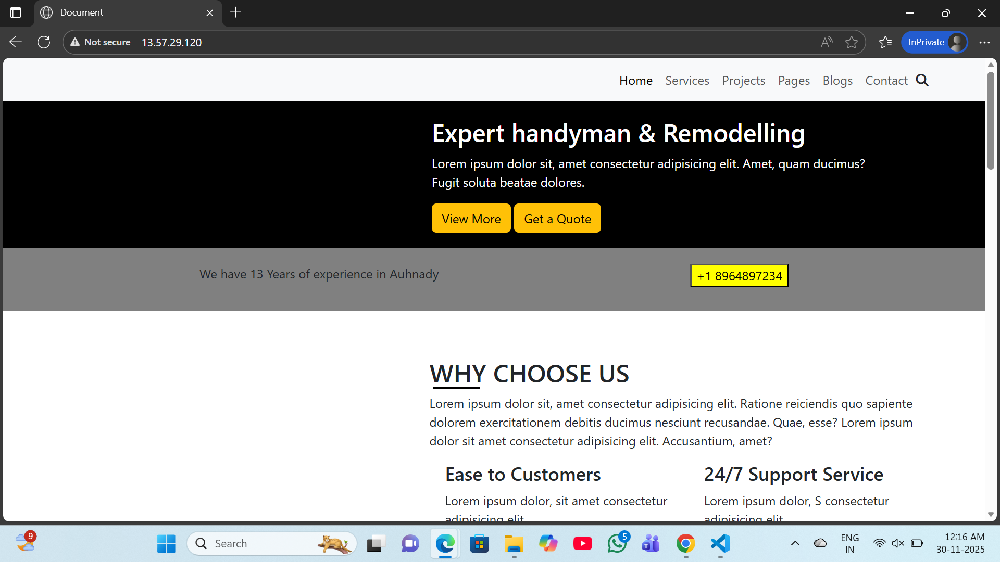

# Static-Website-Hosting using Terraform

## Project Overview

This project demonstrates how to host a static website on an AWS EC2 instance using Terraform as Infrastructure as Code (IaC).
Instead of using Amazon S3, the website is served through Nginx running on an EC2 server, making it closer to real-world server-based hosting.

Terraform automates:

- EC2 instance creation

- Security Group configuration

- Web server setup

- Website deployment

## Architecture

## Architecture Flow:

1. User requests website via browser

2. Request reaches EC2 public IP

3. Security Group allows HTTP (port 80)

4. Nginx serves static website files

## Deployment Steps

### Step-1: Fork the Project
Fork the example static site repo https://github.com/sruthi234/static-website-project to my GitHub
account.

### Step-2: Create Terraform Files

Create a directory and add these files:

1.main.tf

         provider "aws" {
         region = "us-west-1"
  
         }

         resource "aws_key_pair" "jarvis_key" {
           key_name   = var.key_name
           public_key = file(var.public_key_path)
         }

         resource "aws_instance" "web" {
           ami= "ami-03978d951b279ec0b"   
           instance_type = "t3.micro"
           key_name=aws_key_pair.jarvis_key.key_name
           security_groups = [aws_security_group.website_sg.name]

         user_data = <<-EOF
               #!/bin/bash
               yum update -y
               yum install git nginx -y 
               systemctl start nginx  
               systemctl enable nginx   
               mkdir Project
               git clone https://github.com/iamsakshi7108/Static-Website-Hosting.git
               rm -rf /usr/share/nginx/html/*
               cp -r /project/Static-Website-Hosting/* /usr/share/nginx/html/
               chmod -R 755 /usr/share/nginx/html/
             EOF

             tags = {
                 Name = "StaticWebsite"
                  }
             }

             resource "aws_security_group" "website_sg" {
               name = "website-sg"

                  ingress {
                    from_port= 80
                    to_port= 80
                    protocol= "tcp"
                    cidr_blocks = ["0.0.0.0/0"]
                 }

                  egress {
                    from_port= 0
                    to_port= 0
                    protocol= "-1"
                    cidr_blocks = ["0.0.0.0/0"]
                  }
                 ingress {
                   from_port = 22
                   to_port = 22
                   protocol = "tcp"
                   cidr_blocks = ["0.0.0.0/0"]
                 }

                 egress {
                   from_port = 0
                   to_port   = 0
                   protocol  = "-1"
                   cidr_blocks = ["0.0.0.0/0"]
                  }
            }

2.variable.tf

      variable "key_name" {
        default = "jarvis-key"
     }

     variable "public_key_path" {
      default = "~/.ssh/id_rsa.pub"
     }

### Step-3: Initialize and Apply Terraform
From the terraform/ directory:

     terraform init 
     terraform plan  
     terraform apply --auto-approve 

### Step-4:Access the Website

After deployment, Terraform will output the EC2 Public IP.

Open in browser:

    http://<EC2-Public-IP>

Your static website will be live 

## Step-5: Cleanup Resources

To avoid AWS charges:

    terraform destroy --auto-approve

## Conclusion

This project showcases server-based static website hosting using Terraform and AWS EC2.

If you like this project, don’t forget to star the repository!
